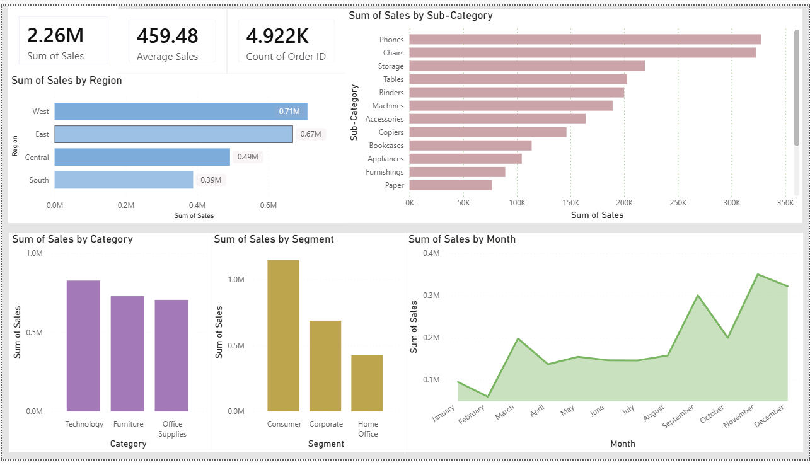

# Sales Performance Dashboard – Power BI

## Project Overview

This project presents an interactive Sales Performance Dashboard developed using Power BI. The objective of this dashboard is to analyze sales data, monitor business performance, and provide meaningful insights through clear and structured visualizations.

The dashboard focuses on high-level performance indicators as well as detailed breakdowns across time and regions.

---

## Dashboard Preview

---

## Key Objectives

- Track overall sales performance
- Identify sales trends over time
- Compare regional contributions
- Provide a quick executive-level business summary
- Support data-driven decision making

---

## Page 1: Executive Summary

This page is designed to provide a quick overview of business performance.

### KPI Cards
The dashboard includes key performance indicators such as:
- Total Sales
- Total Orders
- Average Sales per Order

These KPIs allow stakeholders to immediately understand overall business health without going into detailed analysis.

### Sales by Region (Column Chart)
This visual compares sales across different regions.  
It helps identify which region contributes the highest revenue and which regions may require improvement strategies.

### Sales by Category
This chart highlights how different product categories contribute to total revenue.  
It supports product-level performance evaluation and strategic planning.

---

## Page 2: Sales Trend Analysis

### Sales Over Time (Line Chart)

The line chart shows sales performance across months or years.

Why this visual was used:
- Line charts clearly represent time-based trends
- It helps identify growth patterns
- Detects seasonality
- Highlights peak and low-performing periods

This page helps answer questions like:
- Is the business growing steadily?
- Are there seasonal sales fluctuations?
- Are there sudden drops or spikes?

---

## Page 3: Regional Performance Analysis

This page focuses on deeper regional comparison.

Bar and column charts are used to:
- Compare regional sales contributions
- Identify top-performing and underperforming areas
- Support strategic decisions such as regional marketing focus or expansion

---

## Design Approach

The dashboard follows clean visualization principles:

- Minimal and consistent color palette
- Proper alignment and spacing
- Clear titles and labels
- Avoidance of clutter
- Focus on business insights rather than decorative visuals

Each visual is intentionally placed to guide the viewer from high-level summary to detailed analysis.

---

## Tools & Skills Used

- Power BI Desktop
- Data Modeling
- DAX Measures
- Data Visualization Best Practices
- Business Insight Interpretation

---

## How to Use

1. Download the `.pbix` file.
2. Open it in Power BI Desktop.
3. Navigate across report pages.
4. Use filters (if available) to interact with the data.

---

## Conclusion

This dashboard demonstrates how raw sales data can be transformed into actionable business insights through effective data visualization and structured storytelling.

It showcases practical Power BI skills in data modeling, visualization design, and analytical thinking.

